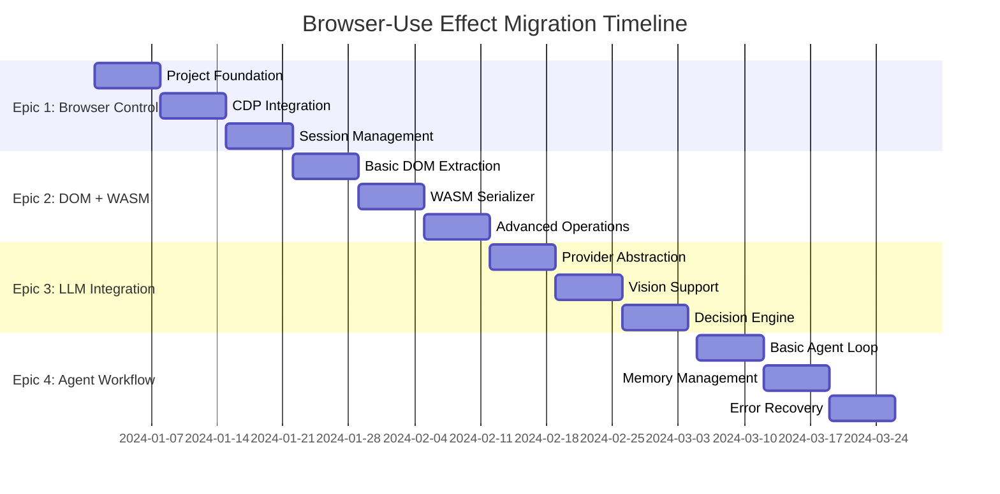

# Implementation Guide: Vertical Slices & Epic Breakdown

## Overview

This guide organizes the browser-use to Effect TypeScript migration into vertical slices and implementation epics. Each vertical slice represents a complete, end-to-end feature that can be implemented, tested, and deployed independently.

## Vertical Slice Strategy

### Why Vertical Slices?

1. **Reduced Risk**: Each slice delivers working functionality
2. **Faster Feedback**: Early validation of architecture decisions  
3. **Parallel Development**: Teams can work on different slices simultaneously
4. **Incremental Value**: Users see immediate benefits from each slice

### Slice Selection Criteria

- **Business Value**: High-impact features first
- **Technical Risk**: Validate riskiest assumptions early
- **Dependencies**: Minimize cross-slice dependencies
- **Complexity**: Balance simple and complex features

## Epic 1: Basic Browser Control (Weeks 1-3)

### Epic Goal
Establish foundational browser automation capabilities with Effect architecture.

### User Story
*"As a developer, I want to launch a browser, navigate to a page, and take screenshots using the new Effect TypeScript library."*

### Technical Scope
- Project setup with TypeScript/Effect
- CDP client integration  
- Basic browser operations
- Configuration management
- Initial testing framework

### Vertical Slice Breakdown

#### Slice 1.1: Project Foundation (Week 1)
**Deliverable**: Working TypeScript project with Effect

```typescript
// Expected API after Slice 1.1
import { BrowserUse, Effect } from "@browser-use/effect"

const program = Effect.gen(function* () {
  const browser = yield* BrowserUse.create({
    headless: false,
    viewport: { width: 1280, height: 720 }
  })
  
  console.log("Browser created successfully")
})

Effect.runPromise(program)
```

**Tasks:**
- [ ] Initialize monorepo with TypeScript & Effect
- [ ] Configure build pipeline (Vite/ESBuild)
- [ ] Set up basic Effect Layer architecture
- [ ] Create configuration schema with Effect Config
- [ ] Implement basic logging with Effect Logger

**Acceptance Criteria:**
- [ ] TypeScript project compiles without errors
- [ ] Effect services can be composed with Layers
- [ ] Configuration loads from environment variables
- [ ] Basic logging outputs to console

#### Slice 1.2: CDP Integration (Week 1-2)
**Deliverable**: CDP client wrapped in Effect

```typescript
// Expected API after Slice 1.2
const program = Effect.gen(function* () {
  const cdp = yield* CDPClient
  
  const result = yield* cdp.send("Browser.getVersion")
  console.log(`Chrome version: ${result.product}`)
})
```

**Tasks:**
- [ ] Integrate chrome-remote-interface with Effect
- [ ] Create typed CDP command interfaces
- [ ] Implement connection lifecycle management
- [ ] Add retry logic with Effect Schedule
- [ ] Create test utilities for CDP mocking

**Acceptance Criteria:**
- [ ] Can connect to Chrome via CDP
- [ ] All CDP commands return Effect types
- [ ] Connection failures are properly handled
- [ ] Tests can mock CDP responses

#### Slice 1.3: Browser Session Management (Week 2-3)
**Deliverable**: Complete browser lifecycle management

```typescript
// Expected API after Slice 1.3
const program = Effect.scoped(
  Effect.gen(function* () {
    const browser = yield* BrowserService
    const session = yield* browser.createSession()
    
    yield* session.navigate("https://example.com")
    const screenshot = yield* session.takeScreenshot()
    
    console.log(`Screenshot captured: ${screenshot.length} bytes`)
    // Browser automatically cleaned up on scope exit
  })
)
```

**Tasks:**
- [ ] Implement browser launching with Playwright
- [ ] Create session management with Effect Scope
- [ ] Add navigation and basic page operations
- [ ] Implement screenshot functionality
- [ ] Add proper resource cleanup

**Acceptance Criteria:**
- [ ] Can launch and close browser sessions
- [ ] Navigation works reliably
- [ ] Screenshots are captured as base64
- [ ] Resources are cleaned up automatically

### Epic 1 Success Metrics
- [ ] Browser can be launched and controlled programmatically
- [ ] All operations return Effect types with proper error handling
- [ ] Configuration is fully environment-driven
- [ ] Test coverage > 80% for basic operations
- [ ] Memory leaks are eliminated through proper resource management

---

## Epic 2: DOM Operations with WASM (Weeks 4-6)

### Epic Goal
Implement high-performance DOM serialization and manipulation using WASM.

### User Story
*"As a developer, I want to serialize large DOM trees 10x faster than the Python version while maintaining full compatibility."*

### Vertical Slice Breakdown

#### Slice 2.1: Basic DOM Extraction (Week 4)
**Deliverable**: DOM tree extraction with TypeScript serialization

```typescript
// Expected API after Slice 2.1
const program = Effect.gen(function* () {
  const browser = yield* BrowserService
  const dom = yield* DOMService
  
  const session = yield* browser.createSession()
  yield* session.navigate("https://example.com")
  
  const tree = yield* dom.extractTree(session)
  const serialized = yield* dom.serialize(tree)
  
  console.log(`DOM serialized: ${serialized.length} characters`)
})
```

**Tasks:**
- [ ] Implement CDP DOM.getDocument integration
- [ ] Create DOMNode schema with Effect Schema
- [ ] Build recursive DOM tree parser
- [ ] Implement TypeScript-based serialization
- [ ] Add comprehensive DOM tree tests

**Acceptance Criteria:**
- [ ] Can extract complete DOM tree from any webpage
- [ ] DOM nodes are properly typed with Effect Schema
- [ ] Serialization produces readable HTML output
- [ ] Handles edge cases (empty nodes, special characters)

#### Slice 2.2: WASM DOM Serializer (Week 5)
**Deliverable**: AssemblyScript-based DOM serialization

```typescript
// API remains same, but implementation uses WASM
const tree = yield* dom.extractTree(session)
const serialized = yield* dom.serialize(tree) // Now uses WASM internally
```

**Tasks:**
- [ ] Set up AssemblyScript build pipeline
- [ ] Implement DOM serializer in AssemblyScript
- [ ] Create TypeScript/WASM interface bindings
- [ ] Add memory management for WASM modules
- [ ] Performance benchmark against TypeScript version

**Acceptance Criteria:**
- [ ] WASM serializer produces identical output to TypeScript
- [ ] 5-10x performance improvement over TypeScript version
- [ ] Memory usage is efficiently managed
- [ ] WASM module loads reliably in all environments

#### Slice 2.3: Advanced DOM Operations (Week 6)
**Deliverable**: Complete DOM manipulation suite

```typescript
// Expected API after Slice 2.3
const program = Effect.gen(function* () {
  const dom = yield* DOMService
  const tree = yield* dom.extractTree(session)
  
  // Find clickable elements using WASM
  const clickables = yield* dom.findClickableElements(tree)
  
  // Filter by viewport visibility
  const visible = yield* dom.filterVisible(clickables, viewport)
  
  // Get element at specific coordinates
  const elementAtPoint = yield* dom.elementAtPoint(visible, 100, 200)
})
```

**Tasks:**
- [ ] Implement clickable element detection in WASM
- [ ] Add geometric calculations (bounding boxes)
- [ ] Create viewport filtering algorithms
- [ ] Build element search and query operations
- [ ] Add performance monitoring

**Acceptance Criteria:**
- [ ] Can identify clickable elements with high accuracy
- [ ] Geometric calculations are pixel-perfect
- [ ] Viewport filtering handles all edge cases
- [ ] Performance meets 10x improvement targets

### Epic 2 Success Metrics
- [ ] DOM serialization is 10x faster than Python baseline
- [ ] Memory usage reduced by 30% compared to TypeScript-only
- [ ] All DOM operations maintain 100% accuracy
- [ ] WASM modules are production-ready with proper error handling

---

## Epic 3: LLM Integration & Decision Making (Weeks 7-9)

### Epic Goal
Create a robust, multi-provider LLM integration system for AI decision making.

### User Story
*"As a user, I want the AI agent to analyze screenshots and DOM content to make intelligent browser automation decisions using various LLM providers."*

### Vertical Slice Breakdown

#### Slice 3.1: LLM Provider Abstraction (Week 7)
**Deliverable**: Multi-provider LLM interface

```typescript
// Expected API after Slice 3.1
const program = Effect.gen(function* () {
  const llm = yield* LLMService
  
  const response = yield* llm.complete({
    messages: [
      { role: "user", content: "What is the capital of France?" }
    ],
    options: { temperature: 0.7, maxTokens: 100 }
  })
  
  console.log(`LLM Response: ${response.content}`)
})
```

**Tasks:**
- [ ] Create LLM service abstraction with Effect
- [ ] Implement OpenAI provider
- [ ] Add Anthropic Claude provider
- [ ] Create configuration system for API keys
- [ ] Build provider switching logic

**Acceptance Criteria:**
- [ ] Can switch between LLM providers seamlessly
- [ ] All providers implement consistent interface
- [ ] Error handling is provider-agnostic
- [ ] Rate limiting is properly implemented

#### Slice 3.2: Vision & Multimodal Support (Week 8)
**Deliverable**: Screenshot analysis capabilities

```typescript
// Expected API after Slice 3.2
const program = Effect.gen(function* () {
  const llm = yield* LLMService
  const browser = yield* BrowserService
  
  const screenshot = yield* browser.takeScreenshot()
  
  const analysis = yield* llm.analyzeScreenshot({
    screenshot,
    prompt: "What interactive elements are visible?",
    format: "json"
  })
  
  console.log(`Found ${analysis.elements.length} interactive elements`)
})
```

**Tasks:**
- [ ] Add image support to LLM messages
- [ ] Implement screenshot analysis prompts
- [ ] Create structured response parsing
- [ ] Add vision model configuration
- [ ] Build multimodal test suite

**Acceptance Criteria:**
- [ ] Can analyze screenshots with vision models
- [ ] Structured responses are properly parsed
- [ ] Image encoding/decoding works reliably
- [ ] Vision analysis is accurate and consistent

#### Slice 3.3: Decision Engine (Week 9)
**Deliverable**: Complete AI decision-making system

```typescript
// Expected API after Slice 3.3
const program = Effect.gen(function* () {
  const agent = yield* AgentService
  
  const decision = yield* agent.decide({
    task: "Click the login button",
    screenshot: yield* browser.takeScreenshot(),
    domTree: yield* dom.extractTree(),
    memory: agentMemory
  })
  
  console.log(`Decision: ${decision.action} on ${decision.target}`)
})
```

**Tasks:**
- [ ] Create decision context aggregation
- [ ] Build prompt templates for decision making
- [ ] Implement action parsing and validation
- [ ] Add decision confidence scoring
- [ ] Create decision logging and debugging

**Acceptance Criteria:**
- [ ] AI makes accurate browser action decisions
- [ ] All decisions include confidence scores
- [ ] Decision process is fully traceable
- [ ] Error handling covers all LLM failure modes

### Epic 3 Success Metrics
- [ ] AI decision accuracy > 90% on test scenarios
- [ ] Response time < 2 seconds for typical decisions
- [ ] All major LLM providers supported
- [ ] Vision analysis identifies UI elements correctly

---

## Epic 4: Agent Workflow & Orchestration (Weeks 10-12)

### Epic Goal
Implement complete AI agent workflow with memory, error recovery, and goal achievement.

### User Story
*"As a user, I want to give the AI agent a high-level task and have it autonomously complete multi-step workflows with proper error handling and progress tracking."*

### Vertical Slice Breakdown

#### Slice 4.1: Basic Agent Loop (Week 10)
**Deliverable**: Autonomous agent execution

```typescript
// Expected API after Slice 4.1
const program = Effect.gen(function* () {
  const agent = yield* AgentService
  
  const result = yield* agent.execute({
    task: "Find and click the 'Sign Up' button",
    maxSteps: 10,
    timeoutMs: 30000
  })
  
  if (result.success) {
    console.log(`Task completed in ${result.steps} steps`)
  } else {
    console.log(`Task failed: ${result.error}`)
  }
})
```

**Tasks:**
- [ ] Implement agent execution loop with Effect Stream
- [ ] Create step-by-step decision and action cycle
- [ ] Add timeout and step limit controls
- [ ] Implement basic success/failure detection
- [ ] Build agent state tracking

**Acceptance Criteria:**
- [ ] Agent can autonomously execute multi-step tasks
- [ ] Proper timeout and step limiting
- [ ] Clear success/failure reporting
- [ ] Agent state is tracked throughout execution

#### Slice 4.2: Memory & Context Management (Week 11)
**Deliverable**: Persistent agent memory system

```typescript
// Expected API after Slice 4.2
const program = Effect.gen(function* () {
  const agent = yield* AgentService
  
  // Agent remembers previous actions and context
  yield* agent.execute({
    task: "Login with username 'john' and password 'secret123'",
    memory: {
      rememberCredentials: true,
      sessionId: "user-session-1"
    }
  })
  
  // Later execution can reference previous context
  yield* agent.execute({
    task: "Navigate to the dashboard",
    sessionId: "user-session-1" // Reuses memory
  })
})
```

**Tasks:**
- [ ] Create persistent agent memory with Effect Ref
- [ ] Implement action history tracking
- [ ] Add context-aware decision making
- [ ] Build memory serialization/deserialization
- [ ] Create memory cleanup policies

**Acceptance Criteria:**
- [ ] Agent maintains context across multiple executions
- [ ] Memory persists between sessions
- [ ] Context influences future decisions appropriately
- [ ] Memory usage is bounded and manageable

#### Slice 4.3: Error Recovery & Resilience (Week 12)
**Deliverable**: Production-ready agent with robust error handling

```typescript
// Expected API after Slice 4.3
const program = Effect.gen(function* () {
  const agent = yield* AgentService
  
  const result = yield* agent.execute({
    task: "Complete the checkout process",
    retryPolicy: {
      maxRetries: 3,
      backoffStrategy: "exponential"
    },
    errorRecovery: {
      onElementNotFound: "takeScreenshotAndRetry",
      onTimeoutError: "refreshPageAndRetry",
      onUnexpectedNavigation: "recalibrateAndContinue"
    }
  })
})
```

**Tasks:**
- [ ] Implement comprehensive error recovery strategies
- [ ] Add retry logic with intelligent backoff
- [ ] Create error classification and handling
- [ ] Build automated screenshot capture on errors
- [ ] Add performance monitoring and alerting

**Acceptance Criteria:**
- [ ] Agent recovers gracefully from common errors
- [ ] Retry policies prevent infinite loops
- [ ] Error context is preserved for debugging
- [ ] Performance monitoring catches regressions

### Epic 4 Success Metrics
- [ ] Agent completes complex multi-step tasks with >85% success rate
- [ ] Error recovery handles >90% of common failure scenarios
- [ ] Memory system scales to handle long-running sessions
- [ ] Agent execution is fully observable and debuggable

---

## Cross-Cutting Concerns

### Performance Monitoring
Implemented across all epics:

```typescript
// Performance monitoring integration
const monitoredOperation = <A, E>(
  operation: Effect.Effect<A, E>,
  name: string
) =>
  pipe(
    operation,
    Effect.withSpan(name),
    Effect.tap((result) => 
      PerformanceMonitor.record(name, {
        duration: performance.now() - startTime,
        success: true,
        metadata: result
      })
    ),
    Effect.tapError((error) =>
      PerformanceMonitor.record(name, {
        duration: performance.now() - startTime,
        success: false,
        error: error.message
      })
    )
  )
```

### Configuration Management
Environment-based config across all components:

```typescript
// Unified configuration system
const AppConfig = Config.all({
  browser: BrowserConfig,
  llm: LLMConfig,
  wasm: WasmConfig,
  monitoring: MonitoringConfig
})

// Usage in services
const MyServiceLive = Layer.effect(
  MyService,
  Effect.gen(function* () {
    const config = yield* AppConfig
    // Service implementation using config
  })
)
```

### Testing Strategy
Each epic includes comprehensive testing:

```typescript
// Test layers for each epic
const EpicTestLive = Layer.mergeAll(
  MockBrowserLive,
  MockLLMLive,
  MockWasmLive,
  TestConfigLive
)

// Integration test example
describe("Epic 1: Basic Browser Control", () => {
  it("completes end-to-end browser session", () =>
    Effect.gen(function* () {
      const browser = yield* BrowserService
      const session = yield* browser.createSession()
      
      yield* session.navigate("https://example.com")
      const screenshot = yield* session.takeScreenshot()
      
      expect(screenshot).toBeDefined()
    }).pipe(
      Effect.provide(EpicTestLive),
      Effect.runPromise
    )
  )
})
```

## Implementation Timeline



## Success Criteria

### Overall Migration Success
- [ ] **Performance**: 10x improvement in DOM operations
- [ ] **Reliability**: >95% agent success rate on test scenarios
- [ ] **Maintainability**: 100% TypeScript type coverage
- [ ] **Observability**: Full tracing and monitoring
- [ ] **Compatibility**: Python API compatibility layer
- [ ] **Documentation**: Complete migration and usage guides

### Epic-Level Gates
Each epic must pass these gates before proceeding:
- [ ] All acceptance criteria met
- [ ] Performance benchmarks achieved
- [ ] Test coverage >90%
- [ ] Security review completed
- [ ] Documentation updated

This implementation guide provides a structured approach to migrating browser-use to Effect TypeScript through focused vertical slices, ensuring each epic delivers concrete value while building toward the complete solution.